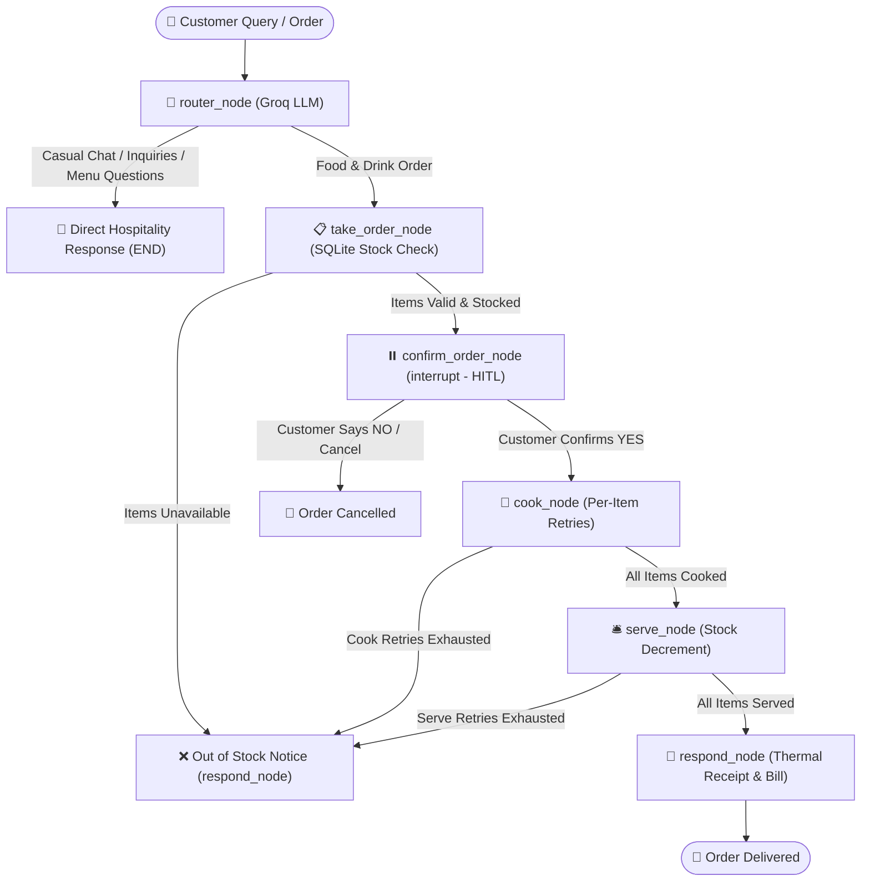

<div align="center">

# 🍛 PetPuja (पेटपूजा) — Smart AI Bistro & Bar
### *Ghar Jaisa Swaad, AI Ka Saath • Indian Culinary Hospitality Meets Modern AI*

[](https://www.python.org/)
[](https://fastapi.tiangolo.com/)
[](https://langchain-ai.github.io/langgraph/)
[](https://groq.com/)
[](https://opensource.org/licenses/MIT)

[Features](#-key-features) • [Architecture](#-architecture) • [Live Deployment](#-cloud-deployment) • [Local Setup](#-local-quickstart) • [API Reference](#-api-endpoints)

</div>

---

## 🌟 Overview

**PetPuja (पेटपूजा)** is an end-to-end AI dining experience designed for a high-energy Indian bistro and bar. Rather than relying on simple text chatbots or brittle forms, PetPuja combines a **cyclic LangGraph StateGraph**, **Groq's ultra-fast LLM inference (`openai/gpt-oss-120b`, `20b`, `qwen3.8-27b`)**, and an **interactive glassmorphism frontend** to deliver authentic culinary hospitality.

Meet **Ramoo Kaka**, your AI Maitre D' who understands traditional Indian gastronomy—from street-style samosas and tandoor-roasted chicken tikka to rich overnight-simmered dal makhani and spirited bar concoctions like Long Island Iced Tea (LIIT) and single-malt whiskies.

---

## ✨ Key Features

- **👨‍🍳 Ramoo Kaka (AI Host & Maitre D')**: Warm, cultured dining host with culinary nuance. Includes a strict dining scope guardrail that politely and humorously deflects non-restaurant questions (LeetCode, coding, homework) back to PetPuja's menu.
- **🍬 Piece-Level & Multi-Turn Dynamic Pricing**: Supports piece-level ordering for multi-piece dishes (e.g. 5 pcs Gulab Jamun @ $2.25/pc = $11.25, 3 pcs Samosa @ $2.00/pc = $6.00). Seamlessly resolves multi-turn references (e.g. asking cost of 5 pieces, then saying *"I'd like to order 5 pieces"*) and converts pieces to portion equivalents for inventory tracking.
- **🛡️ Human-in-the-Loop (HITL) with Flexible Order Additions**: Uses LangGraph's `interrupt()` primitive to present itemized bills, suggest pairings (e.g. chilled Beer or Garlic Naan), and allows customers to add items before confirmation (e.g. *"also add a beer"*) without losing previously selected dishes.
- **🔥 Resilient Kitchen Engine & Partial Fulfillment**: Per-item cooking and serving retry loops with failure simulation. If a dish cannot be prepared, the receipt dynamically adjusts, deducting the unserved item with $0.00 charged.
- **⚡ Multi-Model Groq Fallback Cascade**: High-availability inference with automatic fallback across `openai/gpt-oss-120b`, `openai/gpt-oss-20b`, and `qwen/qwen3.8-27b` to guarantee seamless uptime against token rate limits.
- **📜 37-Dish Bistro & Bar Menu**: Authentic North & South Indian delicacies, street food starters, tandoor specials, biryanis, desserts, and a full cocktail and spirits bar backed by SQLite.
- **🧾 Live Kitchen Tracker & Thermal Receipt**: Real-time visual progress stepper and digital retro thermal receipt with accurate item totals.
- **🎨 Rich Indian Hospitality Aesthetic**: Dark obsidian glassmorphism UI with tandoori crimson, turmeric gold, and brass accents (100% Vanilla CSS).

---

## 🏗️ Architecture



---

## 🚀 Cloud Deployment

### Option 1: Deploy on Render (Recommended • 100% Free)

[](https://render.com)

1. Fork or push this repository to GitHub: `https://github.com/KANTHmayank/PetPuja.git`
2. Go to [Render Dashboard](https://dashboard.render.com/) and click **New + ➔ Web Service**.
3. Connect your GitHub account and select the **PetPuja** repository.
4. Configure the settings:
   - **Environment**: `Python 3`
   - **Build Command**: `pip install -r requirements.txt`
   - **Start Command**: `uvicorn app:app --host 0.0.0.0 --port $PORT`
5. Under **Environment Variables**, add:
   - `GROQ_API_KEY`: Your Groq API key (`gsk_...`)
   - `PYTHON_VERSION`: `3.12.0`
6. Click **Create Web Service**. Your app will be live with a public HTTPS URL (e.g., `https://petpuja.onrender.com`)!

---

### Option 2: Deploy on Hugging Face Spaces (Free Docker Space)

1. Create a new Space on [Hugging Face](https://huggingface.co/new-space).
2. Choose **Docker** as the Space SDK (Blank).
3. In **Settings ➔ Variables and secrets**, add `GROQ_API_KEY` under Secrets.
4. Push this repository to your Hugging Face Space repo:
   ```bash
   git remote add hf https://huggingface.co/spaces/YOUR_USERNAME/PetPuja
   git push hf main
   ```
5. Your Space will build the `Dockerfile` automatically and provide a persistent demo link!

---

## 💻 Local Quickstart

### Prerequisites
- Python 3.11 or 3.12
- [Groq API Key](https://console.groq.com/keys)

### 1. Clone the repository
```bash
git clone https://github.com/KANTHmayank/PetPuja.git
cd PetPuja
```

### 2. Install dependencies
Using `uv` (fastest):
```bash
uv sync
```
Or standard `pip`:
```bash
python -m venv .venv
source .venv/bin/activate  # On Windows: .venv\Scripts\activate
pip install -r requirements.txt
```

### 3. Configure environment variables
Create a `.env` file in the project root:
```ini
GROQ_API_KEY=gsk_your_groq_api_key_here
PORT=8000
```

### 4. Run the application
```bash
# Start the FastAPI server with live frontend
python app.py
```
Visit **[http://127.0.0.1:8000](http://127.0.0.1:8000)** in your browser.

---

## 🔌 API Endpoints

| Method | Endpoint | Description |
| :--- | :--- | :--- |
| `GET` | `/api/menu` | Returns all 37 menu items with live stock, categories, and prices |
| `POST` | `/api/chat` | Sends guest message to Ramoo Kaka (supports conversation thread ID) |
| `POST` | `/api/confirm` | Resumes interrupted graph with human confirmation (`yes` / `no`) |
| `POST` | `/api/reset` | Reseeds the SQLite database inventory to fresh seed stock |

---

## 📁 Project Structure

```text
PetPuja/
├── app.py                  # FastAPI backend & Static files mount
├── db.py                   # SQLite menu engine (37 dishes, piece metadata & stock mutations)
├── graph.py                # LangGraph StateGraph with MemorySaver checkpointer
├── nodes.py                # Router node (Groq LLM), Cook, Serve, and Respond nodes
├── edges.py                # Conditional routing decisions (retries, additions, confirmations)
├── state.py                # RestaurantState TypedDict schema
├── tools.py                # Deterministic kitchen tools (take_order, cook, serve)
├── test_piece_ordering.py  # Automated test suite for piece pricing & multi-turn flows
├── static/
│   ├── index.html          # 3-column bistro & bar UI layout
│   ├── style.css           # Premium Indian glassmorphism design system
│   └── app.js              # Client-side reactivity, HITL modals, & live tracker
├── Dockerfile              # Production container for cloud platforms
├── Procfile                # Process definition for Render / Railway
├── render.yaml             # Render blueprint configuration
├── pyproject.toml          # Modern Python packaging configuration
└── requirements.txt        # Locked production dependencies
```

---

## 📜 License

Distributed under the MIT License. See `LICENSE` for more information.

<div align="center">
  <sub>Built with ❤️ by Mayank Kanth • Powered by LangGraph & Groq</sub>
</div>